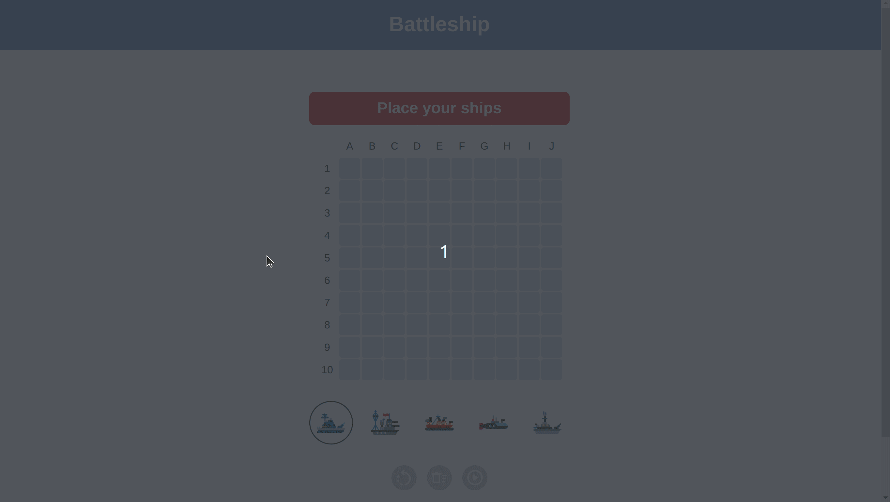
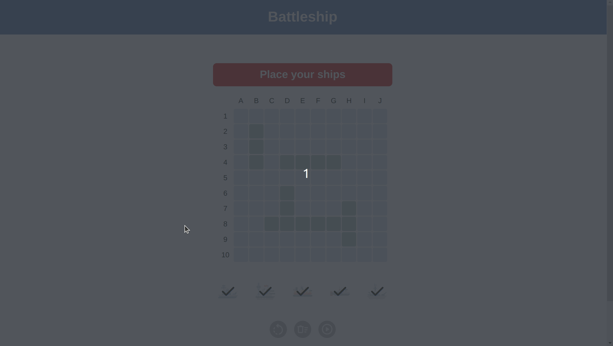
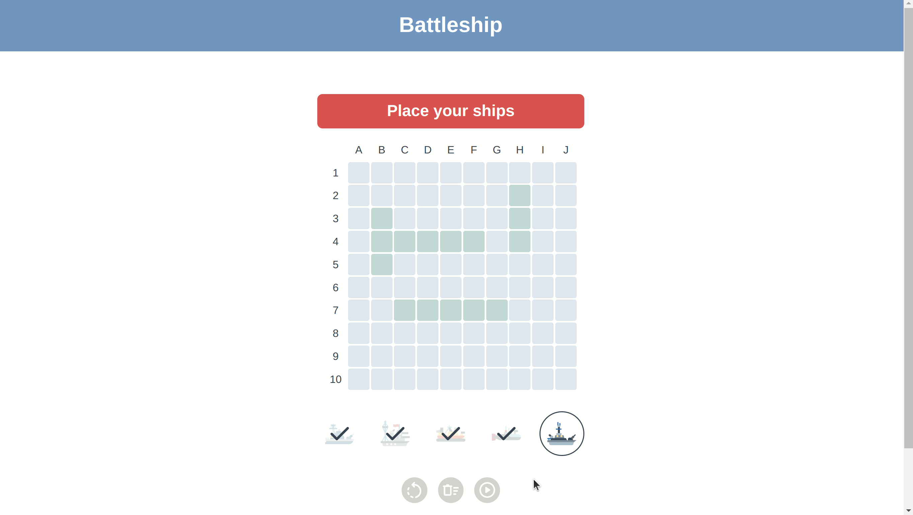
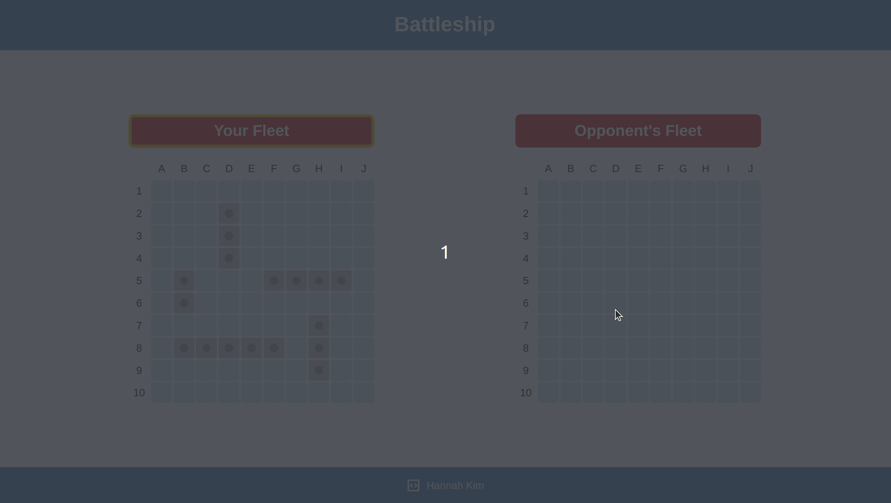

# Battleship
https://hannahkim313.github.io/battleship/

## Project Summary
This project exercise, created by The Odin Project, is an application of the game Battleship. This project is created using Test Driven Development (TDD) practices, specifically unit tests, with Jest. DOM manipulation is not tested for this project, only the application logic.

## Features Overview

### Phase 1: Ship Placement

#### <ins>The Ships</ins>
There are 5 ships from which the user can place onto their board:
* Carrier (5)
* Battleship (4)
* Cruiser (3)
* Submarine (3)
* Destroyer (2)

#### <ins>Ship Orientation and Placement</ins>
The user can place each ship either horizontally or vertically, which is determined by clicking on the rotate button to select the ship's direction. When hovering over the board, valid positions are highlighted in green and invalid positions are highlighted in red. To place a ship, the user must click on a valid position on the board.

A position is considered *valid* if the following are true:
* The ship piece does not overlap with another ship piece on the board
* The ship piece does not exceed the bounds of the board

A position is considered *invalid* if the following are true:
* The ship piece overlaps with another ship piece on the board
* The ship piece exceeds the bounds of the board

Demo:

#### <ins>Resetting the Board</ins>
If the user made a mistake and wants to reset the entire board, they can click on the reset button located right next to the rotate button. A confirmation message will appear to confirm the user is sure they want to reset the board.

Demo:

#### <ins>Starting the game</ins>
When the user is ready to start the game, they can click on the start game button located right next to the reset button. **Note: The game cannot start until all 5 ships are placed on the board.** If the user tries to start the game before meeting this requirement, a message will appear instructing them to place all of their ships.

Demo:

### Phase 2: Game Start

#### <ins>The Gameplay</ins>
The game is played between the user and the opponent (i.e., the computer). Players take turns attacking their opponent's board by selecting a valid position on the board in an attempt to hit and eventually sink all ships. The player who sinks all of their opponent's ships first is the winner of the game.

A position is *valid* if the following is true:
* The position has not already been selected

#### <ins>Markers</ins>
* A **hit** is marked by a grey box with a red dot in the center
* A **miss** is marked by a blue dot in the center

Demo:

## Notes
* The current Webpack configuration development mode is set to `production` and the `clean` option is set to`true`

## Reflection
After completing this project, I found myself enjoying the process of implementing TDD into my workflow. Some of the benefits I personally discovered were the following:
* Less coupling/increased separation of concerns
* Fewer bugs/easier to fix and refactor
* Forced to step back and think about the overall design of the application before writing any code
* Increased confidence that any code I write is less likely to break because of these tests

I also found it more effective and efficient when writing out the application logic and testing them before manipulating the DOM. Ensuring the game logic works provided a solid foundation for the rest of my code to work off of, which otherwise would have resulted in a messier and difficult-to-refactor code.

Learning how to configure Webpack and Jest together was also a big learning curve as this is my first project using Jest in a browser environment. I also found it much easier to manage and write code when using a HTML template with `html-webpack-plugin`. Overall, this project led me to discover new ways of organizing, planning, managing, and writing code that greatly improved the way I will approach projects in the future.

## Credits
* Ship logo used as flaticon from [Freepik](https://www.freepik.com/icon/ship_4814742#fromView=search&term=ship+logo&page=1&position=62&track=ais)
* Ship icons by smalllikeart from [Freepik](https://www.freepik.com/)
* Miscellaneous icons from [Google Fonts](https://fonts.google.com/)